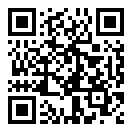

# Matteo Rizzi

<i>matteo@rizzi.xyz</i> <i>@matteounitn:matrix.org</i> <small><i>orcid: <a href="https://orcid.org/0000-0002-5288-3031" style="text-decoration: none;">0000-0002-5288-3031</a></i></small>

#     

---

### Bachelor in Computer Science, Junior Research Scientist

Born in 1998, 30 September, I work as a Junior Research Scientist in the <a href="https://st.fbk.eu">Security and Trust</a> unit at <a href="https://www.fbk.eu">Fondazione Bruno Kessler</a>. I joined the S&T unit to explore and improve TLS analysis and delve into identity management. I am working concurrently between FBK and the Istituto Poligrafico e Zecca dello Stato.

## Experiences

### Fondazione Bruno Kessler (Trento, Italy)

*Junior Research Scientist* $\bullet$ *Feb, 2021 - Present*

Security analysis of the TLS deployments of <a href="https://www.ipzs.it">IPZS</a> projects, TLS Analysis in Android Apps and TLS tool enhancement within the Security & Trust research unit.

---

*Internship* $\bullet$ *Feb, 2020 - May, 2020*

Study and improvement of TLS analysis tools within the Security & Trust research unit.

---

**Futuro & Conoscenza S.r.l. (Trento & Rome, Italy)**

*Junior Research Scientist* $\bullet$ *Jul, 2021 - Present*

Collaboration between <a href="https://www.fbk.eu">Fondazione Bruno Kessler</a> and <a href="https://www.ipzs.it">IPZS</a> to promote the exchange of know-how and competences in the field of security technologies (material and digital) such as identification and and anti-counterfeiting, as well as the creation of a center for the coordination and exploitation of research.

## Papers

### [Demo: TLSAssistant v2](https://doi.org/10.1145/3532105.3535042)

*in ACM Symposium on Access Control Models and Technologies, SACMAT* $\bullet$ *Jun, 2022*

Matteo Rizzi, Salvatore Manfredi, Giada Sciarretta, Silvio Ranise.

----

### [A Modular and Extensible Framework for Securing TLS](https://doi.org/10.1145/3508398.3511505)

*in 12th ACM Conference on Data and Application Security and Privacy, CODASPY* $\bullet$ *Apr, 2022*

Matteo Rizzi, Salvatore Manfredi, Giada Sciarretta, Silvio Ranise.

## Teaching and Tutoring

### Internship Tutor

*Andrea Brandolini and Mattia Andreolli* in FBK, Security and Trust Unit $\bullet$ *Jun, 2022 - Present*

<small> Andrea Brandolini and Mattia Andreolli are two outstanding students from Istituto Tecnico Tecnologico Buonarroti (Trento, Italy). They readily comprehended complicated topics like as databases and overflow threats despite just being in their third year. They are working with me and my colleague Salvatore Manfredi on a project that will raise awareness about security postures (e.g. password management, phishing awareness and more).</small>

---

*Federico Cucino* in FBK, Security and Trust Unit $\bullet$ *Feb, 2022 - Apr, 2022*

<small>I had the opportunity to oversee Federico Cucino, an undergraduate student at University of Trento, thanks to my colleague Salvatore Manfredi. Federico did an excellent job by collecting information on overall webserver use and, more specifically, Public Administration in Italy. Upon learning that NGINX was competing with APACHE, he included several mitigations into NGINX and developed a parser for TLSAssistant. The parser can quickly scan an NGINX configuration and automatically repair any TLS vulnerabilities discovered. Federico was finally able to analyze the TLS environment in deep and correct additional flaws he discovered in the tool.</small>

----

*Ivan Valentini* in FBK, Security and Trust Unit $\bullet$ *Feb, 2022 - Apr, 2022*

<small>Thanks to my colleague Salvatore Manfredi, I have overseen the internship of an undergraduate student at University of Trento, Ivan Valentini. Ivan, a talented student, researched the TLS area to see what new threats had emerged. Ivan encountered ALPACA, Racoon, Zombie POODLE, Golden DOODLE, 0-Length OpenSSL, and Sleeping POODLE after researching the literature. Using POODLE variations as a starting point, Ivan investigated the optimal method for integrating these vulnerability checks into TLSAssistant. Ivan progressively included all prior vulnerability assessments (i.e. ALPACA, POODLE variants and Racoon). Not only did he incorporate them into our tool, but he also corrected and made the external tool TLSScanner more efficient by statistically demonstrating it by scanning the Alexa top 50,000 websites.</small>

## Projects

**Multi-CIE System**

*Ideation of the Multi-CIE function in the CieID App $\bullet$ Jan, 2022 - March, 2022*

The CieID App allows users to verify themselves for public services in Italy by using the CIE Card, commonly known as Carta di Identità Elettronica (eID card). Worked as part of a team to develop the best method for storing multiple eID cards in the APP while keeping the highest level of security and determining the optimum balance of security and usability.

----

### [breaking-telegram](https://github.com/matteounitn/breaking-telegram)

*PoC script to break Telegram $\bullet$ 2021*

Simple PoC script that allows you to exploit telegram's "send with timer" feature by saving any media received with this functionality, automatically.

---

### [TLSAssistant](https://github.com/stfbk/tlsassistant)

*Starting from Version 1.3* $\bullet$ *2020 - Present*

Fully-featured tool that combines state-of-the-art TLS analyzers with a report system that suggests appropriate mitigations and shows the full set of viable attacks.

---

### [iHashDNA](https://github.com/matteounitn/iHashDNA)

*Perceptual hashing library in python $\bullet$ 2020 - 2022 (Suspended)*

Python library to easily check if two images are similar without machine learning by using Perceptual Hashing (phash and whash combined), with ban and unban image system.

## Minor Works

### [Mallodroid](https://github.com/stfbk/mallodroid)

*Conversion in Python 3 and enhancements* $\bullet$ *2020 - 2021*

---

### [telegram-deep-fakes-bot](https://github.com/albertoxamin/telegram-deep-fakes-bot)

*Easy implementation and use of the first order model* $\bullet$ *2020*

---

### [Rappresentanti Bot](https://github.com/matteounitn/rappdisibot)

*HelpDesk Telegram bot to support DISI Students in University of Trento* $\bullet$ 2019

## Education

### University of Trento (Trento, Italy)

*Bachelor of Computer Science* $\bullet$ *Sept, 2017 - Mar, 2021*

Thesis in *TLS Analyzers for Android Apps - State-of-the-art Analysis and Integration in TLSAssistant.*

---

### I.I.S. Primo Levi (Badia Polesine, Italy)

*High School Diploma* $\bullet$ *Sept, 2012 - Sept, 2017*

Final elaborate in *psychoanalysis of James Joyce and the artificial intelligences*.

## Certifications

**CyberWiser - CyberRange And Capacity Building in CyberSecurity**

| Module      | Date         |                                                  Certificate |
| :---------- | :----------- | -----------------------------------------------------------: |
| *P-01-M-01* | May 19, 2021 | [Download](certificates/cyberwiser/P-01-M-01_Final certificate.pdf) |
| *P-01-M-02* | May 20, 2021 | [Download](certificates/cyberwiser/P-01-M-02_Final certificate.pdf) |
| *P-02*      | May 20, 2021 | [Download](certificates/cyberwiser/P-02_Final certificate.pdf) |
| *P-03*      | May 20, 2021 | [Download](certificates/cyberwiser/P-03_Final certificate.pdf) |
| *P-04*      | May 25, 2021 | [Download](certificates/cyberwiser/P-04_Final certificate.pdf) |
| *P-05*      | June 4, 2021 | [Download](certificates/cyberwiser/P-05_Final certificate.pdf) |
| *P-06*      | June 4, 2021 | [Download](certificates/cyberwiser/P-06_Final certificate.pdf) |
|             |              |                                                              |

-----

**First Certificate**

*Cambridge Assessment English - B2 $\bullet$ Apr, 2017*

----

### ECDL Base

*ECDL / ICDL Certification $\bullet$ May, 2016*

## Technical and Programming Skills

 I am widely proficient in everything that touches the cybersecurity realm. My areas of expertise include security testing, vulnerability assessment, cyberrisk assessment, network security (e.g. DmZ, firewalls, honeypots), privacy, trust, and digital identity. During the Machine Learning course, I worked with advanced deep learning systems (such as a convolutional neural network to identify Covid-19 from radiography, in 2020) and achieved the highest gpa in multimedia data security (e.g. invisible and visible watermarking, compression resistant watermarking and classifying differences from video compression applied by Facebook and Youtube).

| Language                       |       Knowledge Level        |
| :----------------------------- | :--------------------------: |
| Python, Java, C (and C++), SQL |          *Advanced*          |
| Kotlin, PHP                    |        *Intermediate*        |
| RUST                           | *Basic (willing to improve)* |
| JS, PolyML, R, ASM             |           *Basic*            |
|                                |                              |

## Interests and Soft Skills

### Work Interests

*What i really want to do in my future* $\bullet$ *2022*

I am passionate about <i>CyberSecurity, Privacy, Forensics and Digital Identity</i>, as well as the solutions that embrace these areas, which include (but are <i>not limited to</i>) <i>Security Protocol Analysis, Access Control, Zero-Trust and Zero-Knowledge methods, Malware Analysis and AI-Powered CyberSecurity</i>. I am particularly intrigued by the idea of developing novel solutions and conducting scientific research in these fields.

I would like to understand better how to conduct red teaming in a professional and certified manner.

---

### University of Trento (Trento, Italy)

*Student Representative for DISI* $\bullet$ *Nov, 2018 - Nov, 2022*

Department Of Information Engineering And Computer Science

# 

# 

